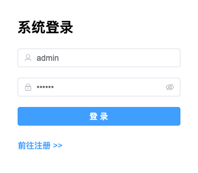
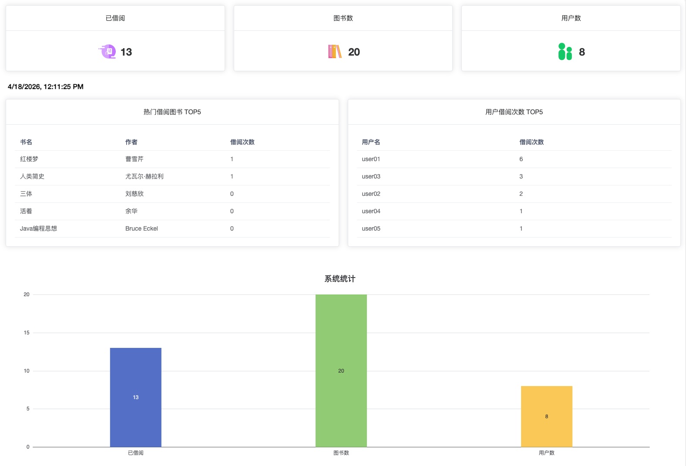
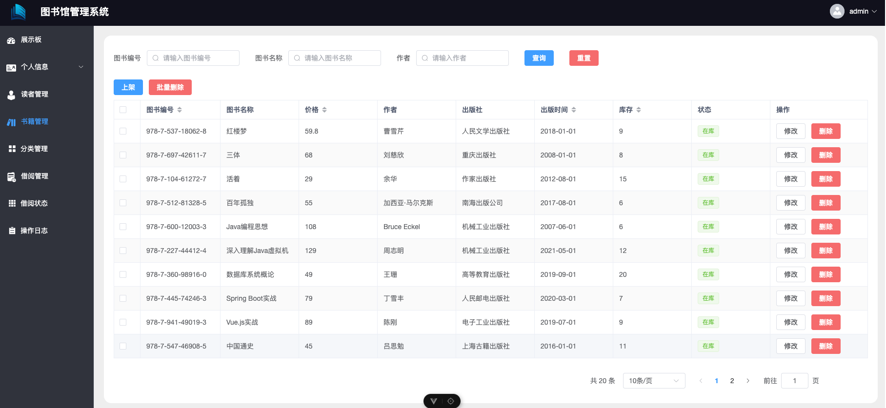
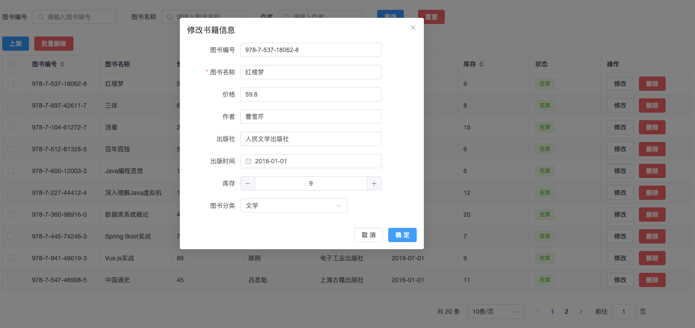
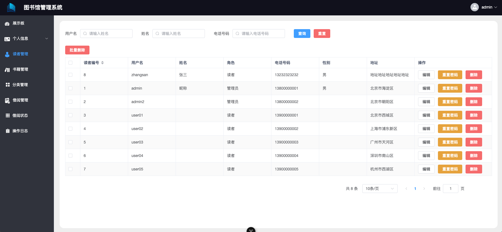
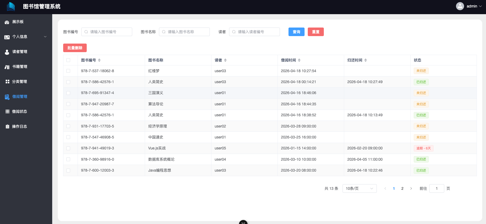
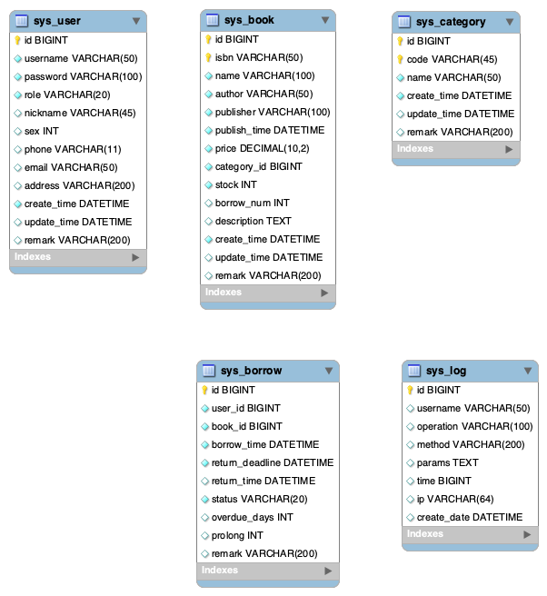

# 图书馆管理系统（library-system）

## 本地快捷预览项目

第一步：新建数据库`springboot-vue`, 运行 sql 文件夹下的`Dump20260417.sql`

第二步：进入SpringBoot文件夹，安装maven依赖，在application.properties中配置数据库及密码，运行成功会运行在`后端地址: http://localhost:8088/api`

第三步：进入vue文件夹，node24版本，执行`yarn`安装依赖，成功后执行`yarn dev`, `o + enter`,打开默认浏览器,可看到登录界面

第四步：测试账号在sys_user表中，管理员账号:admin, 密码:123456

## 主要技术

SpringBoot、Mybatis-Plus、MySQL、Vue3、ElementPlus等

## 主要功能

管理员模块：注册、登录、书籍管理、读者管理、借阅管理、借阅状态、修改个人信息、修改密码

读者模块：注册、登录、查询图书信息、借阅和归还图书、查看个人借阅记录、修改个人信息、修改密码

## 主要功能截图

### 登录

### 展示板页面

#### 图书管理

- 图书表格列表

- 编辑图书

#### 读者管理

- 读者列表
  

#### 借阅管理

- 借阅记录查询
  

## 数据库

